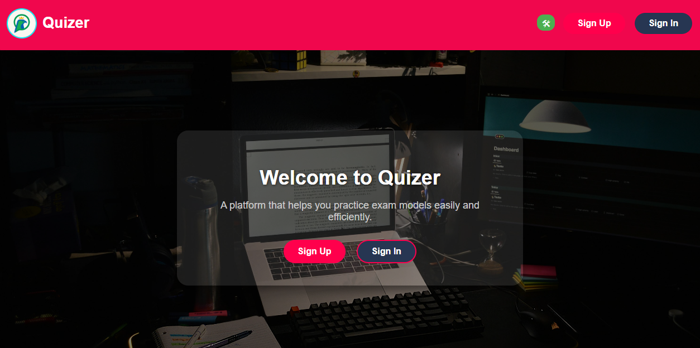
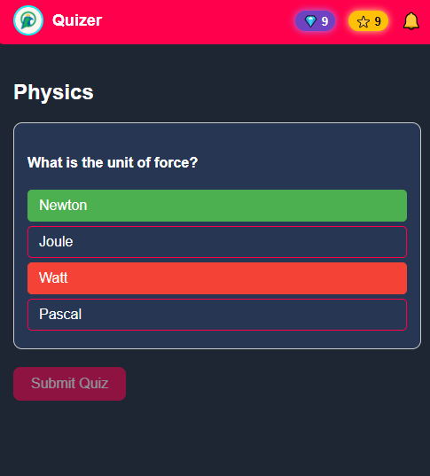
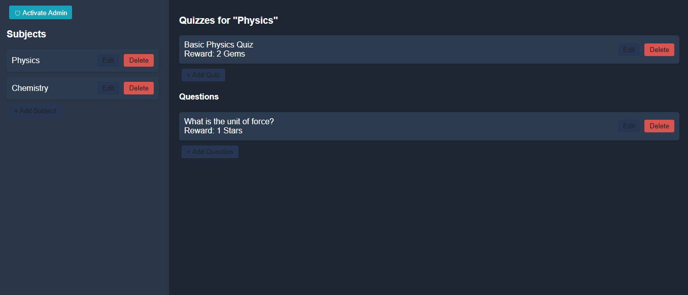

# Quizer Frontend

Quizer Frontend is the user-facing application for the **Quizer** ecosystem. It provides an interactive and engaging interface for solving exams and practice quizzes before real examinations. The goal is to help students measure their skills, discover weaknesses, and reinforce knowledge through practice.

This project is designed to work with the **Quizer Backend API**, but it can be deployed independently as a static frontend and connected to any compatible Quizer API instance.

---

## Purpose and Use Case

Quizer Frontend is not just a quiz viewer. It is a lightweight examination platform that can be used by:

* Individual students for self-assessment and revision.
* Schools to run practice exams, assessments, or surveys.
* Student communities (online or local) to share and attempt exams collaboratively.

By solving questions and receiving immediate feedback, students learn from mistakes, which improves retention and understanding. The experience is enhanced with a simple game-like system based on stars and gems, encouraging engagement without turning learning into pure competition.

---

## Key Features

* Multiple subjects, each containing multiple exams.
* Interactive and visually clean questions.
* Practice-oriented exam flow focused on learning, not punishment.
* Gamification elements such as stars and gems.
* Works as a static frontend connected to an external API.

---

## Screenshots

Here are some screenshots of the Quizer Frontend:








## Project Architecture

The frontend has a deliberately simple structure:

* Static HTML, CSS, and JavaScript files.
* No complex build process or frontend framework.
* Communication with the backend happens entirely through HTTP requests to the Quizer API.

### Important Configuration Note

The API endpoint **must** be properly configured before using the frontend.

In the file:

```

/static/js/base.js

```

There is a variable named `ApiUrl` which defines the backend API URL.

* Currently, it points to a personal Render deployment for testing: `https://quizer-m9vw.onrender.com`.
* Note: The Render server may go to sleep or be temporarily unavailable, so this URL might not always respond.
* For production or stable usage, replace it with your own backend API URL.
* If `ApiUrl` is empty or misconfigured, a global alert will appear on all pages to prevent silent failures.

Since `base.js` is shared across all pages, this warning ensures that developers or administrators configure the API correctly before deployment.

---

## Backend Dependency

Quizer Frontend requires a compatible backend API.

The official backend implementation is available here:

[https://github.com/muaid773/Quizer.git](https://github.com/muaid773/Quizer.git)

A complete setup typically includes:

* Deploying the Quizer Backend API on a server.
* Deploying this frontend on:

  * A public hosting service, or
  * A local network server (for schools or institutions).
* Configuring `ApiUrl` to point to the backend API.

---

## Deployment

Because this project is fully static:

* It can be hosted on any static file server.
* It works on local networks without internet access.
* No special server-side configuration is required for the frontend.

This makes it suitable for schools, training centers, or temporary exam environments.

---

## Extensibility and Future Vision

The current implementation focuses on simplicity and accessibility, but the concept can be expanded significantly, for example:

* A community-driven platform where students create and share exams.
* Competitive or collaborative challenges between students.
* Discussion rooms attached to exams for academic discussion.
* A school-oriented version with:

  * Student performance analytics.
  * Exam results and rankings.
  * Surveys and feedback tools.
* Fully online exams for situations where in-person attendance is not possible.

In this sense, Quizer can evolve from a practice tool into a focused academic social platform.

---

## License

This project is open-source and free to use for educational purposes.

---

## Notes

This frontend is intentionally minimal and transparent. Its strength lies in clarity, ease of deployment, and educational usefulness rather than visual excess or unnecessary complexity.
